# Exploratory Data Analysis Report On Diwali Sales In India


```python
import pandas as pd
```

## Loading Data in a Dataframe


```python
sales_df = pd.read_csv('Diwali Sales Data.csv',encoding= 'unicode_escape')
```


```python
sales_df
```


<div>
<style scoped>
    .dataframe tbody tr th:only-of-type {
        vertical-align: middle;
    }

    .dataframe tbody tr th {
        vertical-align: top;
    }

    .dataframe thead th {
        text-align: right;
    }
</style>
<table border="1" class="dataframe">
  <thead>
    <tr style="text-align: right;">
      <th></th>
      <th>User_ID</th>
      <th>Cust_name</th>
      <th>Product_ID</th>
      <th>Gender</th>
      <th>Age Group</th>
      <th>Age</th>
      <th>Marital_Status</th>
      <th>State</th>
      <th>Zone</th>
      <th>Occupation</th>
      <th>Product_Category</th>
      <th>Orders</th>
      <th>Amount</th>
      <th>Status</th>
      <th>unnamed1</th>
    </tr>
  </thead>
  <tbody>
    <tr>
      <th>0</th>
      <td>1002903</td>
      <td>Sanskriti</td>
      <td>P00125942</td>
      <td>F</td>
      <td>26-35</td>
      <td>28</td>
      <td>0</td>
      <td>Maharashtra</td>
      <td>Western</td>
      <td>Healthcare</td>
      <td>Auto</td>
      <td>1</td>
      <td>23952.0</td>
      <td>NaN</td>
      <td>NaN</td>
    </tr>
    <tr>
      <th>1</th>
      <td>1000732</td>
      <td>Kartik</td>
      <td>P00110942</td>
      <td>F</td>
      <td>26-35</td>
      <td>35</td>
      <td>1</td>
      <td>Andhra Pradesh</td>
      <td>Southern</td>
      <td>Govt</td>
      <td>Auto</td>
      <td>3</td>
      <td>23934.0</td>
      <td>NaN</td>
      <td>NaN</td>
    </tr>
    <tr>
      <th>2</th>
      <td>1001990</td>
      <td>Bindu</td>
      <td>P00118542</td>
      <td>F</td>
      <td>26-35</td>
      <td>35</td>
      <td>1</td>
      <td>Uttar Pradesh</td>
      <td>Central</td>
      <td>Automobile</td>
      <td>Auto</td>
      <td>3</td>
      <td>23924.0</td>
      <td>NaN</td>
      <td>NaN</td>
    </tr>
    <tr>
      <th>3</th>
      <td>1001425</td>
      <td>Sudevi</td>
      <td>P00237842</td>
      <td>M</td>
      <td>0-17</td>
      <td>16</td>
      <td>0</td>
      <td>Karnataka</td>
      <td>Southern</td>
      <td>Construction</td>
      <td>Auto</td>
      <td>2</td>
      <td>23912.0</td>
      <td>NaN</td>
      <td>NaN</td>
    </tr>
    <tr>
      <th>4</th>
      <td>1000588</td>
      <td>Joni</td>
      <td>P00057942</td>
      <td>M</td>
      <td>26-35</td>
      <td>28</td>
      <td>1</td>
      <td>Gujarat</td>
      <td>Western</td>
      <td>Food Processing</td>
      <td>Auto</td>
      <td>2</td>
      <td>23877.0</td>
      <td>NaN</td>
      <td>NaN</td>
    </tr>
    <tr>
      <th>...</th>
      <td>...</td>
      <td>...</td>
      <td>...</td>
      <td>...</td>
      <td>...</td>
      <td>...</td>
      <td>...</td>
      <td>...</td>
      <td>...</td>
      <td>...</td>
      <td>...</td>
      <td>...</td>
      <td>...</td>
      <td>...</td>
      <td>...</td>
    </tr>
    <tr>
      <th>11246</th>
      <td>1000695</td>
      <td>Manning</td>
      <td>P00296942</td>
      <td>M</td>
      <td>18-25</td>
      <td>19</td>
      <td>1</td>
      <td>Maharashtra</td>
      <td>Western</td>
      <td>Chemical</td>
      <td>Office</td>
      <td>4</td>
      <td>370.0</td>
      <td>NaN</td>
      <td>NaN</td>
    </tr>
    <tr>
      <th>11247</th>
      <td>1004089</td>
      <td>Reichenbach</td>
      <td>P00171342</td>
      <td>M</td>
      <td>26-35</td>
      <td>33</td>
      <td>0</td>
      <td>Haryana</td>
      <td>Northern</td>
      <td>Healthcare</td>
      <td>Veterinary</td>
      <td>3</td>
      <td>367.0</td>
      <td>NaN</td>
      <td>NaN</td>
    </tr>
    <tr>
      <th>11248</th>
      <td>1001209</td>
      <td>Oshin</td>
      <td>P00201342</td>
      <td>F</td>
      <td>36-45</td>
      <td>40</td>
      <td>0</td>
      <td>Madhya Pradesh</td>
      <td>Central</td>
      <td>Textile</td>
      <td>Office</td>
      <td>4</td>
      <td>213.0</td>
      <td>NaN</td>
      <td>NaN</td>
    </tr>
    <tr>
      <th>11249</th>
      <td>1004023</td>
      <td>Noonan</td>
      <td>P00059442</td>
      <td>M</td>
      <td>36-45</td>
      <td>37</td>
      <td>0</td>
      <td>Karnataka</td>
      <td>Southern</td>
      <td>Agriculture</td>
      <td>Office</td>
      <td>3</td>
      <td>206.0</td>
      <td>NaN</td>
      <td>NaN</td>
    </tr>
    <tr>
      <th>11250</th>
      <td>1002744</td>
      <td>Brumley</td>
      <td>P00281742</td>
      <td>F</td>
      <td>18-25</td>
      <td>19</td>
      <td>0</td>
      <td>Maharashtra</td>
      <td>Western</td>
      <td>Healthcare</td>
      <td>Office</td>
      <td>3</td>
      <td>188.0</td>
      <td>NaN</td>
      <td>NaN</td>
    </tr>
  </tbody>
</table>
<p>11251 rows × 15 columns</p>
</div>


```python
sales_df.shape
```


    (11251, 15)


```python
sales_df.info()
```

    <class 'pandas.core.frame.DataFrame'>
    RangeIndex: 11251 entries, 0 to 11250
    Data columns (total 15 columns):
     #   Column            Non-Null Count  Dtype  
    ---  ------            --------------  -----  
     0   User_ID           11251 non-null  int64  
     1   Cust_name         11251 non-null  object 
     2   Product_ID        11251 non-null  object 
     3   Gender            11251 non-null  object 
     4   Age Group         11251 non-null  object 
     5   Age               11251 non-null  int64  
     6   Marital_Status    11251 non-null  int64  
     7   State             11251 non-null  object 
     8   Zone              11251 non-null  object 
     9   Occupation        11251 non-null  object 
     10  Product_Category  11251 non-null  object 
     11  Orders            11251 non-null  int64  
     12  Amount            11239 non-null  float64
     13  Status            0 non-null      float64
     14  unnamed1          0 non-null      float64
    dtypes: float64(3), int64(4), object(8)
    memory usage: 1.3+ MB
    

## Data Cleaning 


```python
sales_df.drop(['unnamed1','Status'],axis = 1,inplace=True)
```


```python
sales_df
```


<div>
<style scoped>
    .dataframe tbody tr th:only-of-type {
        vertical-align: middle;
    }

    .dataframe tbody tr th {
        vertical-align: top;
    }

    .dataframe thead th {
        text-align: right;
    }
</style>
<table border="1" class="dataframe">
  <thead>
    <tr style="text-align: right;">
      <th></th>
      <th>User_ID</th>
      <th>Cust_name</th>
      <th>Product_ID</th>
      <th>Gender</th>
      <th>Age Group</th>
      <th>Age</th>
      <th>Marital_Status</th>
      <th>State</th>
      <th>Zone</th>
      <th>Occupation</th>
      <th>Product_Category</th>
      <th>Orders</th>
      <th>Amount</th>
    </tr>
  </thead>
  <tbody>
    <tr>
      <th>0</th>
      <td>1002903</td>
      <td>Sanskriti</td>
      <td>P00125942</td>
      <td>F</td>
      <td>26-35</td>
      <td>28</td>
      <td>0</td>
      <td>Maharashtra</td>
      <td>Western</td>
      <td>Healthcare</td>
      <td>Auto</td>
      <td>1</td>
      <td>23952.0</td>
    </tr>
    <tr>
      <th>1</th>
      <td>1000732</td>
      <td>Kartik</td>
      <td>P00110942</td>
      <td>F</td>
      <td>26-35</td>
      <td>35</td>
      <td>1</td>
      <td>Andhra Pradesh</td>
      <td>Southern</td>
      <td>Govt</td>
      <td>Auto</td>
      <td>3</td>
      <td>23934.0</td>
    </tr>
    <tr>
      <th>2</th>
      <td>1001990</td>
      <td>Bindu</td>
      <td>P00118542</td>
      <td>F</td>
      <td>26-35</td>
      <td>35</td>
      <td>1</td>
      <td>Uttar Pradesh</td>
      <td>Central</td>
      <td>Automobile</td>
      <td>Auto</td>
      <td>3</td>
      <td>23924.0</td>
    </tr>
    <tr>
      <th>3</th>
      <td>1001425</td>
      <td>Sudevi</td>
      <td>P00237842</td>
      <td>M</td>
      <td>0-17</td>
      <td>16</td>
      <td>0</td>
      <td>Karnataka</td>
      <td>Southern</td>
      <td>Construction</td>
      <td>Auto</td>
      <td>2</td>
      <td>23912.0</td>
    </tr>
    <tr>
      <th>4</th>
      <td>1000588</td>
      <td>Joni</td>
      <td>P00057942</td>
      <td>M</td>
      <td>26-35</td>
      <td>28</td>
      <td>1</td>
      <td>Gujarat</td>
      <td>Western</td>
      <td>Food Processing</td>
      <td>Auto</td>
      <td>2</td>
      <td>23877.0</td>
    </tr>
    <tr>
      <th>...</th>
      <td>...</td>
      <td>...</td>
      <td>...</td>
      <td>...</td>
      <td>...</td>
      <td>...</td>
      <td>...</td>
      <td>...</td>
      <td>...</td>
      <td>...</td>
      <td>...</td>
      <td>...</td>
      <td>...</td>
    </tr>
    <tr>
      <th>11246</th>
      <td>1000695</td>
      <td>Manning</td>
      <td>P00296942</td>
      <td>M</td>
      <td>18-25</td>
      <td>19</td>
      <td>1</td>
      <td>Maharashtra</td>
      <td>Western</td>
      <td>Chemical</td>
      <td>Office</td>
      <td>4</td>
      <td>370.0</td>
    </tr>
    <tr>
      <th>11247</th>
      <td>1004089</td>
      <td>Reichenbach</td>
      <td>P00171342</td>
      <td>M</td>
      <td>26-35</td>
      <td>33</td>
      <td>0</td>
      <td>Haryana</td>
      <td>Northern</td>
      <td>Healthcare</td>
      <td>Veterinary</td>
      <td>3</td>
      <td>367.0</td>
    </tr>
    <tr>
      <th>11248</th>
      <td>1001209</td>
      <td>Oshin</td>
      <td>P00201342</td>
      <td>F</td>
      <td>36-45</td>
      <td>40</td>
      <td>0</td>
      <td>Madhya Pradesh</td>
      <td>Central</td>
      <td>Textile</td>
      <td>Office</td>
      <td>4</td>
      <td>213.0</td>
    </tr>
    <tr>
      <th>11249</th>
      <td>1004023</td>
      <td>Noonan</td>
      <td>P00059442</td>
      <td>M</td>
      <td>36-45</td>
      <td>37</td>
      <td>0</td>
      <td>Karnataka</td>
      <td>Southern</td>
      <td>Agriculture</td>
      <td>Office</td>
      <td>3</td>
      <td>206.0</td>
    </tr>
    <tr>
      <th>11250</th>
      <td>1002744</td>
      <td>Brumley</td>
      <td>P00281742</td>
      <td>F</td>
      <td>18-25</td>
      <td>19</td>
      <td>0</td>
      <td>Maharashtra</td>
      <td>Western</td>
      <td>Healthcare</td>
      <td>Office</td>
      <td>3</td>
      <td>188.0</td>
    </tr>
  </tbody>
</table>
<p>11251 rows × 13 columns</p>
</div>


```python
sales_df.isnull().sum()
```


    User_ID              0
    Cust_name            0
    Product_ID           0
    Gender               0
    Age Group            0
    Age                  0
    Marital_Status       0
    State                0
    Zone                 0
    Occupation           0
    Product_Category     0
    Orders               0
    Amount              12
    dtype: int64


```python
sales_df.dropna(inplace = True)
```


```python
sales_df.isnull().sum()
```


    User_ID             0
    Cust_name           0
    Product_ID          0
    Gender              0
    Age Group           0
    Age                 0
    Marital_Status      0
    State               0
    Zone                0
    Occupation          0
    Product_Category    0
    Orders              0
    Amount              0
    dtype: int64


```python
sales_df['Amount'] = sales_df['Amount'].astype('int')
```


```python
sales_df['Amount'].dtype
```


    dtype('int32')


```python
sales_df.rename(columns = {'Marital_Status':'Married'},inplace=True)   
```


```python
sales_df
```


<div>
<style scoped>
    .dataframe tbody tr th:only-of-type {
        vertical-align: middle;
    }

    .dataframe tbody tr th {
        vertical-align: top;
    }

    .dataframe thead th {
        text-align: right;
    }
</style>
<table border="1" class="dataframe">
  <thead>
    <tr style="text-align: right;">
      <th></th>
      <th>User_ID</th>
      <th>Cust_name</th>
      <th>Product_ID</th>
      <th>Gender</th>
      <th>Age Group</th>
      <th>Age</th>
      <th>Married</th>
      <th>State</th>
      <th>Zone</th>
      <th>Occupation</th>
      <th>Product_Category</th>
      <th>Orders</th>
      <th>Amount</th>
    </tr>
  </thead>
  <tbody>
    <tr>
      <th>0</th>
      <td>1002903</td>
      <td>Sanskriti</td>
      <td>P00125942</td>
      <td>F</td>
      <td>26-35</td>
      <td>28</td>
      <td>0</td>
      <td>Maharashtra</td>
      <td>Western</td>
      <td>Healthcare</td>
      <td>Auto</td>
      <td>1</td>
      <td>23952</td>
    </tr>
    <tr>
      <th>1</th>
      <td>1000732</td>
      <td>Kartik</td>
      <td>P00110942</td>
      <td>F</td>
      <td>26-35</td>
      <td>35</td>
      <td>1</td>
      <td>Andhra Pradesh</td>
      <td>Southern</td>
      <td>Govt</td>
      <td>Auto</td>
      <td>3</td>
      <td>23934</td>
    </tr>
    <tr>
      <th>2</th>
      <td>1001990</td>
      <td>Bindu</td>
      <td>P00118542</td>
      <td>F</td>
      <td>26-35</td>
      <td>35</td>
      <td>1</td>
      <td>Uttar Pradesh</td>
      <td>Central</td>
      <td>Automobile</td>
      <td>Auto</td>
      <td>3</td>
      <td>23924</td>
    </tr>
    <tr>
      <th>3</th>
      <td>1001425</td>
      <td>Sudevi</td>
      <td>P00237842</td>
      <td>M</td>
      <td>0-17</td>
      <td>16</td>
      <td>0</td>
      <td>Karnataka</td>
      <td>Southern</td>
      <td>Construction</td>
      <td>Auto</td>
      <td>2</td>
      <td>23912</td>
    </tr>
    <tr>
      <th>4</th>
      <td>1000588</td>
      <td>Joni</td>
      <td>P00057942</td>
      <td>M</td>
      <td>26-35</td>
      <td>28</td>
      <td>1</td>
      <td>Gujarat</td>
      <td>Western</td>
      <td>Food Processing</td>
      <td>Auto</td>
      <td>2</td>
      <td>23877</td>
    </tr>
    <tr>
      <th>...</th>
      <td>...</td>
      <td>...</td>
      <td>...</td>
      <td>...</td>
      <td>...</td>
      <td>...</td>
      <td>...</td>
      <td>...</td>
      <td>...</td>
      <td>...</td>
      <td>...</td>
      <td>...</td>
      <td>...</td>
    </tr>
    <tr>
      <th>11246</th>
      <td>1000695</td>
      <td>Manning</td>
      <td>P00296942</td>
      <td>M</td>
      <td>18-25</td>
      <td>19</td>
      <td>1</td>
      <td>Maharashtra</td>
      <td>Western</td>
      <td>Chemical</td>
      <td>Office</td>
      <td>4</td>
      <td>370</td>
    </tr>
    <tr>
      <th>11247</th>
      <td>1004089</td>
      <td>Reichenbach</td>
      <td>P00171342</td>
      <td>M</td>
      <td>26-35</td>
      <td>33</td>
      <td>0</td>
      <td>Haryana</td>
      <td>Northern</td>
      <td>Healthcare</td>
      <td>Veterinary</td>
      <td>3</td>
      <td>367</td>
    </tr>
    <tr>
      <th>11248</th>
      <td>1001209</td>
      <td>Oshin</td>
      <td>P00201342</td>
      <td>F</td>
      <td>36-45</td>
      <td>40</td>
      <td>0</td>
      <td>Madhya Pradesh</td>
      <td>Central</td>
      <td>Textile</td>
      <td>Office</td>
      <td>4</td>
      <td>213</td>
    </tr>
    <tr>
      <th>11249</th>
      <td>1004023</td>
      <td>Noonan</td>
      <td>P00059442</td>
      <td>M</td>
      <td>36-45</td>
      <td>37</td>
      <td>0</td>
      <td>Karnataka</td>
      <td>Southern</td>
      <td>Agriculture</td>
      <td>Office</td>
      <td>3</td>
      <td>206</td>
    </tr>
    <tr>
      <th>11250</th>
      <td>1002744</td>
      <td>Brumley</td>
      <td>P00281742</td>
      <td>F</td>
      <td>18-25</td>
      <td>19</td>
      <td>0</td>
      <td>Maharashtra</td>
      <td>Western</td>
      <td>Healthcare</td>
      <td>Office</td>
      <td>3</td>
      <td>188</td>
    </tr>
  </tbody>
</table>
<p>11239 rows × 13 columns</p>
</div>


```python
sales_df.replace({'Married':{0:'Unmarried',1:'Married'}},inplace = True)
```


```python
sales_df
```


<div>
<style scoped>
    .dataframe tbody tr th:only-of-type {
        vertical-align: middle;
    }

    .dataframe tbody tr th {
        vertical-align: top;
    }

    .dataframe thead th {
        text-align: right;
    }
</style>
<table border="1" class="dataframe">
  <thead>
    <tr style="text-align: right;">
      <th></th>
      <th>User_ID</th>
      <th>Cust_name</th>
      <th>Product_ID</th>
      <th>Gender</th>
      <th>Age Group</th>
      <th>Age</th>
      <th>Married</th>
      <th>State</th>
      <th>Zone</th>
      <th>Occupation</th>
      <th>Product_Category</th>
      <th>Orders</th>
      <th>Amount</th>
    </tr>
  </thead>
  <tbody>
    <tr>
      <th>0</th>
      <td>1002903</td>
      <td>Sanskriti</td>
      <td>P00125942</td>
      <td>F</td>
      <td>26-35</td>
      <td>28</td>
      <td>Unmarried</td>
      <td>Maharashtra</td>
      <td>Western</td>
      <td>Healthcare</td>
      <td>Auto</td>
      <td>1</td>
      <td>23952</td>
    </tr>
    <tr>
      <th>1</th>
      <td>1000732</td>
      <td>Kartik</td>
      <td>P00110942</td>
      <td>F</td>
      <td>26-35</td>
      <td>35</td>
      <td>Married</td>
      <td>Andhra Pradesh</td>
      <td>Southern</td>
      <td>Govt</td>
      <td>Auto</td>
      <td>3</td>
      <td>23934</td>
    </tr>
    <tr>
      <th>2</th>
      <td>1001990</td>
      <td>Bindu</td>
      <td>P00118542</td>
      <td>F</td>
      <td>26-35</td>
      <td>35</td>
      <td>Married</td>
      <td>Uttar Pradesh</td>
      <td>Central</td>
      <td>Automobile</td>
      <td>Auto</td>
      <td>3</td>
      <td>23924</td>
    </tr>
    <tr>
      <th>3</th>
      <td>1001425</td>
      <td>Sudevi</td>
      <td>P00237842</td>
      <td>M</td>
      <td>0-17</td>
      <td>16</td>
      <td>Unmarried</td>
      <td>Karnataka</td>
      <td>Southern</td>
      <td>Construction</td>
      <td>Auto</td>
      <td>2</td>
      <td>23912</td>
    </tr>
    <tr>
      <th>4</th>
      <td>1000588</td>
      <td>Joni</td>
      <td>P00057942</td>
      <td>M</td>
      <td>26-35</td>
      <td>28</td>
      <td>Married</td>
      <td>Gujarat</td>
      <td>Western</td>
      <td>Food Processing</td>
      <td>Auto</td>
      <td>2</td>
      <td>23877</td>
    </tr>
    <tr>
      <th>...</th>
      <td>...</td>
      <td>...</td>
      <td>...</td>
      <td>...</td>
      <td>...</td>
      <td>...</td>
      <td>...</td>
      <td>...</td>
      <td>...</td>
      <td>...</td>
      <td>...</td>
      <td>...</td>
      <td>...</td>
    </tr>
    <tr>
      <th>11246</th>
      <td>1000695</td>
      <td>Manning</td>
      <td>P00296942</td>
      <td>M</td>
      <td>18-25</td>
      <td>19</td>
      <td>Married</td>
      <td>Maharashtra</td>
      <td>Western</td>
      <td>Chemical</td>
      <td>Office</td>
      <td>4</td>
      <td>370</td>
    </tr>
    <tr>
      <th>11247</th>
      <td>1004089</td>
      <td>Reichenbach</td>
      <td>P00171342</td>
      <td>M</td>
      <td>26-35</td>
      <td>33</td>
      <td>Unmarried</td>
      <td>Haryana</td>
      <td>Northern</td>
      <td>Healthcare</td>
      <td>Veterinary</td>
      <td>3</td>
      <td>367</td>
    </tr>
    <tr>
      <th>11248</th>
      <td>1001209</td>
      <td>Oshin</td>
      <td>P00201342</td>
      <td>F</td>
      <td>36-45</td>
      <td>40</td>
      <td>Unmarried</td>
      <td>Madhya Pradesh</td>
      <td>Central</td>
      <td>Textile</td>
      <td>Office</td>
      <td>4</td>
      <td>213</td>
    </tr>
    <tr>
      <th>11249</th>
      <td>1004023</td>
      <td>Noonan</td>
      <td>P00059442</td>
      <td>M</td>
      <td>36-45</td>
      <td>37</td>
      <td>Unmarried</td>
      <td>Karnataka</td>
      <td>Southern</td>
      <td>Agriculture</td>
      <td>Office</td>
      <td>3</td>
      <td>206</td>
    </tr>
    <tr>
      <th>11250</th>
      <td>1002744</td>
      <td>Brumley</td>
      <td>P00281742</td>
      <td>F</td>
      <td>18-25</td>
      <td>19</td>
      <td>Unmarried</td>
      <td>Maharashtra</td>
      <td>Western</td>
      <td>Healthcare</td>
      <td>Office</td>
      <td>3</td>
      <td>188</td>
    </tr>
  </tbody>
</table>
<p>11239 rows × 13 columns</p>
</div>


```python
sales_df.describe()
```


<div>
<style scoped>
    .dataframe tbody tr th:only-of-type {
        vertical-align: middle;
    }

    .dataframe tbody tr th {
        vertical-align: top;
    }

    .dataframe thead th {
        text-align: right;
    }
</style>
<table border="1" class="dataframe">
  <thead>
    <tr style="text-align: right;">
      <th></th>
      <th>User_ID</th>
      <th>Age</th>
      <th>Orders</th>
      <th>Amount</th>
    </tr>
  </thead>
  <tbody>
    <tr>
      <th>count</th>
      <td>1.123900e+04</td>
      <td>11239.000000</td>
      <td>11239.000000</td>
      <td>11239.000000</td>
    </tr>
    <tr>
      <th>mean</th>
      <td>1.003004e+06</td>
      <td>35.410357</td>
      <td>2.489634</td>
      <td>9453.610553</td>
    </tr>
    <tr>
      <th>std</th>
      <td>1.716039e+03</td>
      <td>12.753866</td>
      <td>1.114967</td>
      <td>5222.355168</td>
    </tr>
    <tr>
      <th>min</th>
      <td>1.000001e+06</td>
      <td>12.000000</td>
      <td>1.000000</td>
      <td>188.000000</td>
    </tr>
    <tr>
      <th>25%</th>
      <td>1.001492e+06</td>
      <td>27.000000</td>
      <td>2.000000</td>
      <td>5443.000000</td>
    </tr>
    <tr>
      <th>50%</th>
      <td>1.003064e+06</td>
      <td>33.000000</td>
      <td>2.000000</td>
      <td>8109.000000</td>
    </tr>
    <tr>
      <th>75%</th>
      <td>1.004426e+06</td>
      <td>43.000000</td>
      <td>3.000000</td>
      <td>12675.000000</td>
    </tr>
    <tr>
      <th>max</th>
      <td>1.006040e+06</td>
      <td>92.000000</td>
      <td>4.000000</td>
      <td>23952.000000</td>
    </tr>
  </tbody>
</table>
</div>


# Data Visualisation 


```python
import seaborn as sns
import matplotlib.pyplot as plt
%matplotlib inline
```

## Analysis Based on Gender


```python
plt.pie(sales_df.Gender.value_counts(),labels=sales_df.Gender.value_counts().index,autopct='%1.1f%%',);
```


    
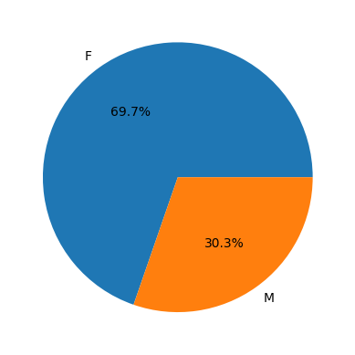
    


```python
sales_gen = sales_df.groupby(['Gender'],as_index=False)[['Amount']].sum().sort_values(by='Amount',ascending = False)
```


```python
sales_gen
```


<div>
<style scoped>
    .dataframe tbody tr th:only-of-type {
        vertical-align: middle;
    }

    .dataframe tbody tr th {
        vertical-align: top;
    }

    .dataframe thead th {
        text-align: right;
    }
</style>
<table border="1" class="dataframe">
  <thead>
    <tr style="text-align: right;">
      <th></th>
      <th>Gender</th>
      <th>Amount</th>
    </tr>
  </thead>
  <tbody>
    <tr>
      <th>0</th>
      <td>F</td>
      <td>74335853</td>
    </tr>
    <tr>
      <th>1</th>
      <td>M</td>
      <td>31913276</td>
    </tr>
  </tbody>
</table>
</div>


## Purchasing power based on Genders


```python
sns.barplot(x = 'Gender' , y = 'Amount',data = sales_gen);
plt.gca().yaxis.get_major_formatter().set_scientific(False)
```


    
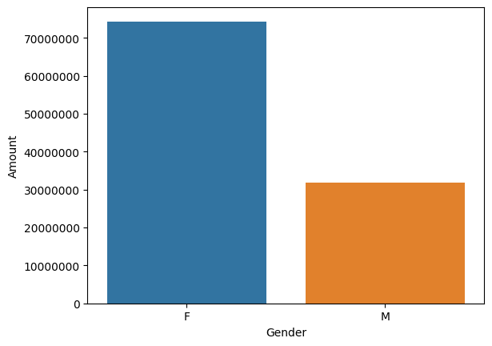
    


## Analysis Based on Age Group


```python
age_df = sales_df.groupby('Age Group',as_index = False).value_counts()
sns.countplot(x = 'Age Group',data = age_df,hue = 'Gender');
```


    
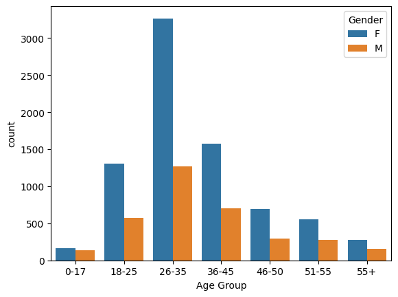
    


## Purchasing power based on age group


```python
sales_age = sales_df.groupby(['Age Group'],as_index = False)[['Amount']].sum().sort_values(by = 'Amount',ascending =False)
```


```python
sns.barplot(x = 'Age Group',y='Amount',data = sales_age)
plt.gca().yaxis.get_major_formatter().set_scientific(False)
```


    
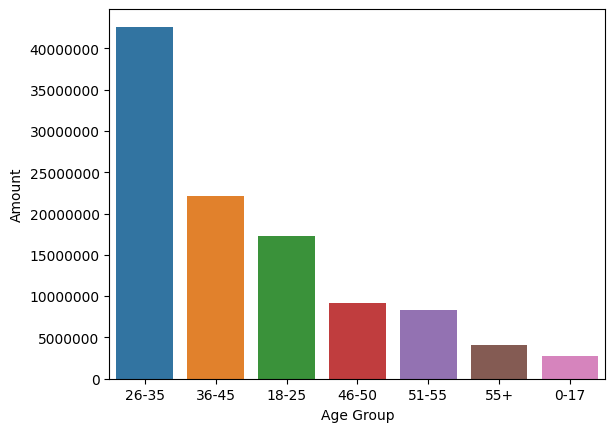
    


## Analysis based of different states


```python
sales_state = sales_df.groupby(['State'],as_index = False)[['Orders']].sum().sort_values(by = 'Orders',ascending = False)
```


```python
sns.barplot(y = 'State',x = 'Orders',data = sales_state);
```


    
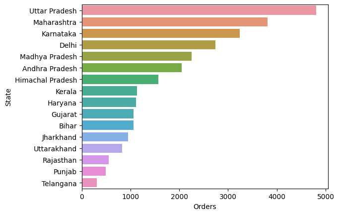
    


## Total amount of each state


```python
sales_amt = sales_df.groupby(['State'],as_index = False)[['Amount']].sum().sort_values(by = 'Amount',ascending = False).head(10)
```


```python
sns.barplot(x = 'State',y= 'Amount',data = sales_amt);
plt.gca().yaxis.get_major_formatter().set_scientific(False)
plt.xticks(rotation = 75);
```


    
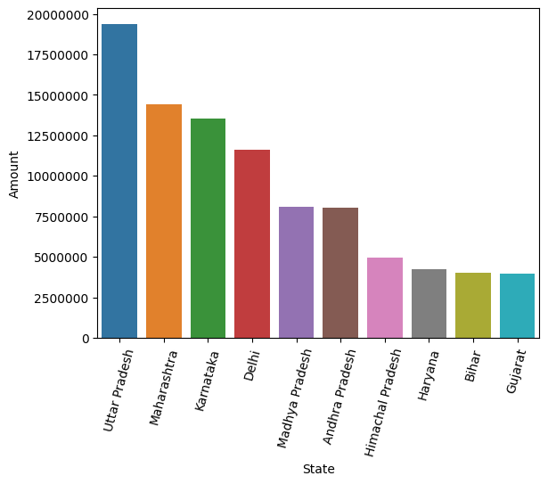
    


## Marital Status of customers


```python
marital_df = sales_df.Married.value_counts()
```


```python
plt.pie(marital_df,labels = marital_df.index,autopct='%1.1f%%');
```


    
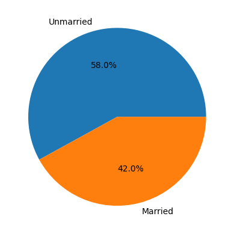
    


```python
salesMarried = sales_df.groupby(['Married','Gender'],as_index = False)[['Amount']].sum().sort_values(by = 'Amount',ascending=False)
```


```python
sns.barplot(x='Married',y = 'Amount',hue = 'Gender',data = salesMarried)
plt.gca().yaxis.get_major_formatter().set_scientific(False);
```


    
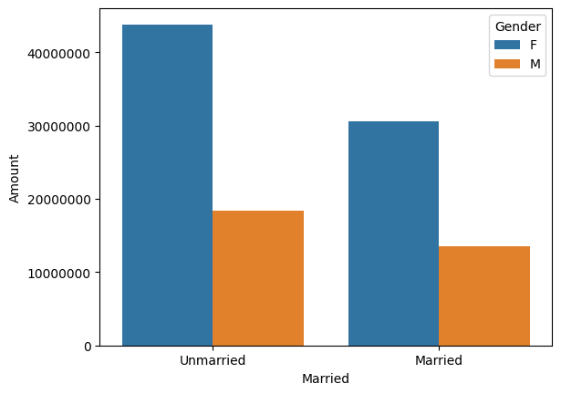
    


## Analysis on Occupation of customers


```python
plt.figure(figsize = (15,5))
plt.xticks(rotation = 45)
sns.countplot(x= 'Occupation',data = sales_df);
```


    
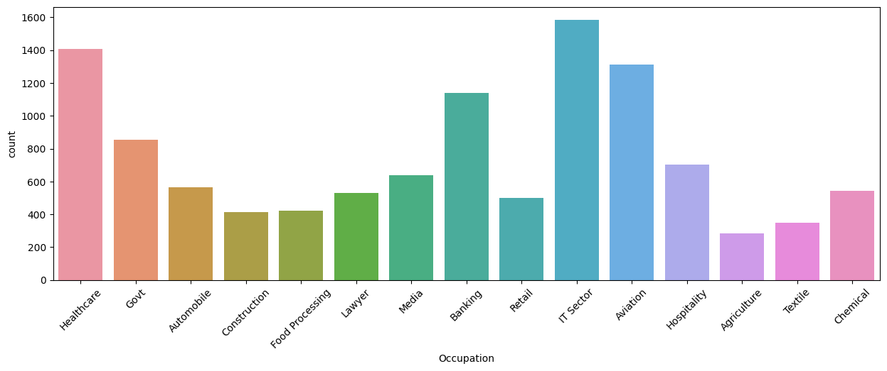
    


## Amount spent by customers working in each sector


```python
occupation_amt = sales_df.groupby(['Occupation'],as_index = False)[['Amount']].sum().sort_values(by = 'Amount',ascending = False)
```


```python
plt.figure(figsize = (12,8))
sns.barplot(y = 'Occupation',x = 'Amount', data = occupation_amt)
plt.gca().xaxis.get_major_formatter().set_scientific(False);
```


    

    


## Bestselling product categories 


```python
sns.countplot(y = 'Product_Category',data = sales_df);
```


    
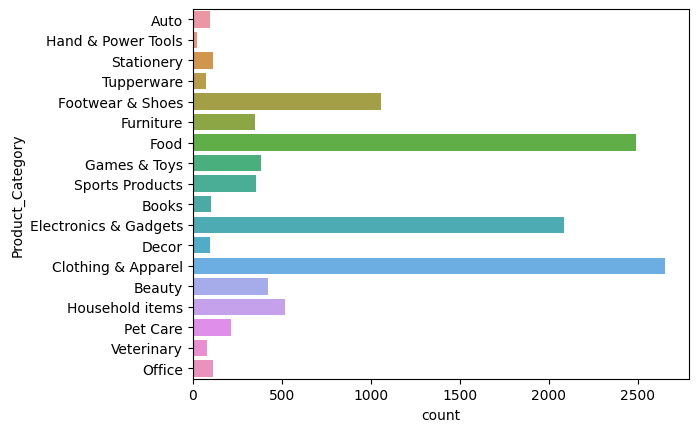
    


## Amount spent on each category


```python
cat_amt = sales_df.groupby(['Product_Category'],as_index = False)[['Amount']].sum().sort_values(by = 'Amount',ascending = False).head(10)
```


```python
plt.figure(figsize = (15,5))
plt.xticks(rotation = 45)
sns.barplot(y = 'Amount',x = 'Product_Category',data = cat_amt)
plt.gca().yaxis.get_major_formatter().set_scientific(False);
```


    
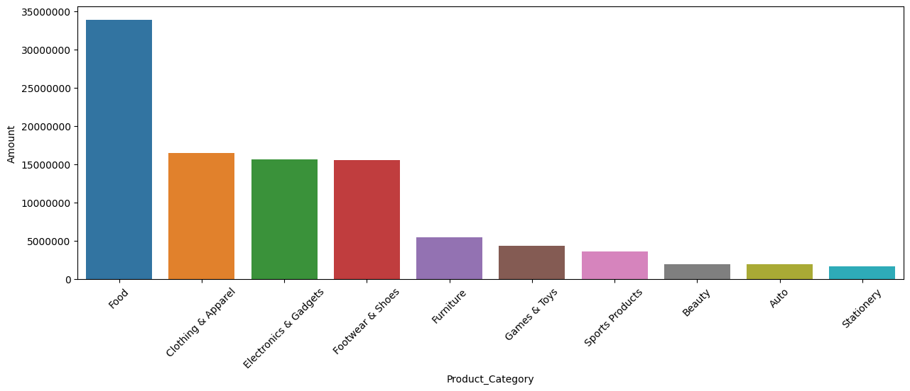
    


## Most sold product based on product category


```python

top_sold = sales_df.groupby(['Product_ID'],as_index = False)[['Orders']].sum().sort_values(by = 'Orders',ascending = False).head(10)
```


```python
plt.figure(figsize = (15,5))
plt.xticks(rotation = 45)
sns.barplot(y = 'Orders',x = 'Product_ID',data = top_sold)
plt.gca().yaxis.get_major_formatter().set_scientific(False);
```


    
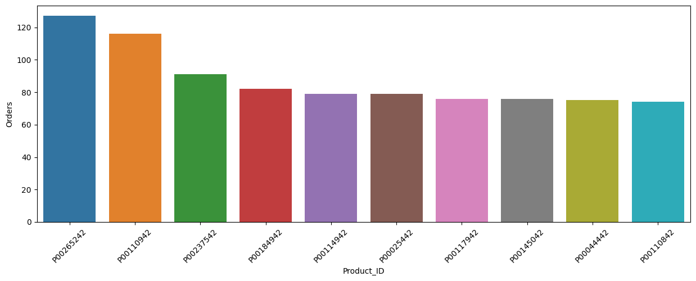
    


## Zones with the most sales percentage


```python
plt.pie(sales_df.Zone.value_counts(),labels=sales_df.Zone.value_counts().index,autopct='%1.1f%%',);
```


    
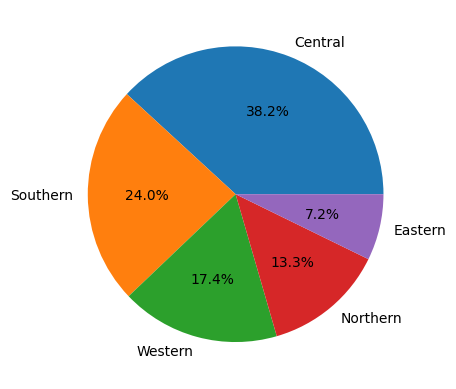
    


# CONCLUSION:


Unmarried Women age group 26-35 from UP ,Maharashtra and Karnataka working in IT , Healthcare and Aviation buy products from food , clothing and electronic Categories


```python

```
